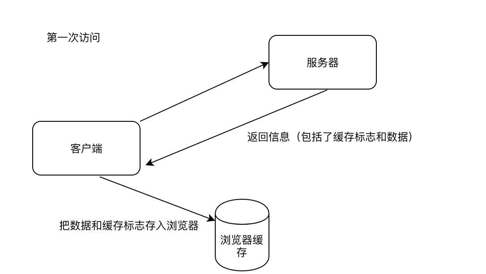
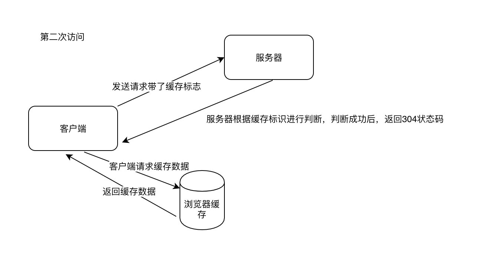
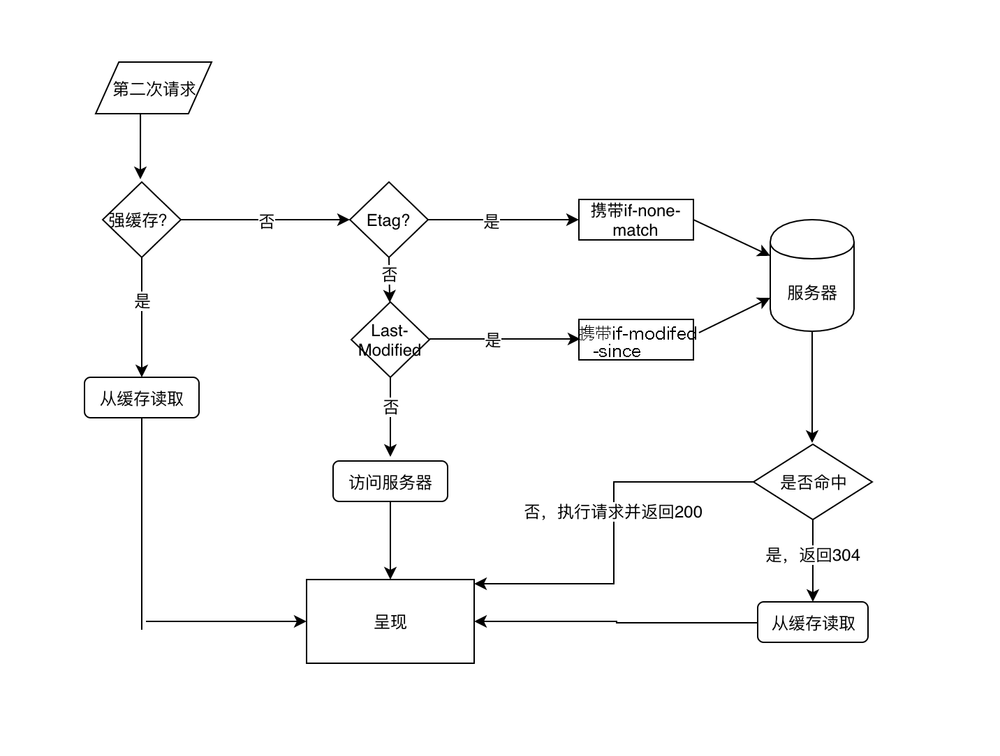

## 深入HTTP缓存机制及原理

身为一个web开发者，必要的http缓存机制还是要去深入了解，因为在这上面可以做很多的web性能优化。要想成为一个好的架构师，这一环节必不可少。

---

### 一、http报文

因为缓存机制要用到报文，所以这里简单介绍下http报文。  

现在广泛的应用还是HTTP1.1，HTTP1.0已经很少见了。**HTTP协议交互的信息被称为HTTP报文。HTTP报文由报文首部、空行（CR+LF）、报文主体。HTTP报文分为请求报文、响应报文。**

报文信息主要分为两个部分：

- 报文头部 请求的附加信息（cookie,缓存信息，缓存规则信息，请求类型，请求源Referer等等）

- 报文内容 HTTP真正想要传输的内容（客户端传输的内容和服务端返回的内容）

---

### 二、缓存（强缓存&协商缓存）

这里谈的缓存，主要是浏览器缓存。至于服务器缓存（redis之类的）的就不谈了，不在关联范围。  

浏览器是一个主体，一个程序。所以它拥有分配的资源，有存放缓存的资源地带。  
**正常的首先第一次访问网站的时候，所以先向服务器请求资源，然后客户端拿到，然后存入浏览器缓存地带。**
接下来我们可以把浏览器的缓存分为强缓存和协商缓存两种。

#### 强缓存

强缓存是属于不需要访问服务器，直接从浏览器缓存里面拿数据，呈现给客户端。  

我们知道，在没有缓存数据的时候，浏览器向服务器请求数据时，服务器会将数据和缓存规则一并返回，缓存规则信息包含在响应header中。对于强缓存来说在header中有两个字段Expires和Cache-Control，**其中Expires 是HTTP 1.0的东西，现在默认浏览器均默认使用HTTP 1.1，所以它的作用基本忽略。**所以我们主要谈Cache-Control。

Cache-Control（主要几个，可以同时存在多个参数,例如：max-age = 60,public）

- private（默认值） 浏览器可以缓存，打开新窗口会再次访问服务器

- public  指令指服务器返回不仅可以被浏览器缓存，而且可以被中间代理缓存，后续其他用户请求该资源，都可以直接使用该的缓存。打开新窗口会再次访问服务器(大体上，如css、js这些公共资源需要使用public缓存起来，从而加快页面加载)

- max-age = xxx（重要） 就是告诉浏览器，缓存内容在多久之后（以秒计算）失效，在这个范围内，强缓存直接命中。在范围内打开新窗口不会访问服务器

- no-cache 不使用强缓存，使用协商缓存，打开新窗口会再次访问服务器

- no-store 所以内容都不缓存。（虽然说是为了保护敏感数据，但是基本不考虑。。）

举个例子，如果http请求头带了 `Cache-Control:max-age=60`,也就是说在60秒之内再次请求这个资源，直接使用强缓存，从浏览器取。

强缓存命中的时候，network状态码是200（from cache）

#### 协商缓存

也就是说需要和服务器协商之后，再判断需要从浏览器拿缓存不。  

同样的在第一次发送请求之后，服务器会把一些特定的标识字段返回给客户端，然后客户端交给浏览器缓存起来。当再次请求的时候，客户端将存下来的标识字段通过请求发送给服务端，如果匹配成功，服务器返回304状态码，通知客户端比较成功，可以从浏览器拿缓存数据。（下面画了两个图来理解两次发送）

第一次发送：
  

第二次发送：

标识字段一共有两种：

- If-Modified-Since（Request header）/ Last-Modified（Response header

- If-None-Match（Request header）/ Etag（Response header）

上面我们说到，第一次访问的时候，服务器会发送缓存标志给客户端，就是Last-Modified、Etag。客户端拿到后把他们存入浏览器缓存，下次访问的时候通过If-Modified-Since和If-None-Match两个字段发送过去，内容和接收到的是相同的。`If-Modified-Since = Last-Modified;If-None-Match = Etag`。

Last-Modified ：服务器返回的资源最后修改时间。

Etag ： 当前资源在服务器的唯一标识（规则由服务器决定）。

#### 对比总结

对于强制缓存，服务器通知浏览器一个缓存时间，在缓存时间内，下次请求，直接用缓存，不在时间内，执行协商缓存策略。  
对于协商缓存，将缓存信息中的Etag和Last-Modified通过请求发送给服务器，由服务器校验，返回304状态码时，浏览器直接使用缓存。同时Etag的优先级要高于Last-Modified。  

在第二次访问的时候，是先判断是否有强缓存，然后再判断协商缓存。具体可以看下面的图：

